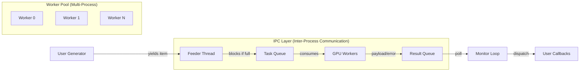

# Design Document: `gpu_dispatch`

## 1. Overview

`**gpu_dispatch**` is a lightweight, high-throughput task orchestration library designed for multi-GPU inference workloads. It connects a data generation source (Main Thread) to a persistent pool of GPU workers (Child Processes) using an efficient IPC (Inter-Process Communication) pipeline.

### Core Design Principles


1. **Discrete & Lightweight**: Minimal abstraction. It does one thing well: dispatching tasks to available GPUs.
2. **Worker-Centric Lifecycle**: Explicit separation of `setup` (initialization), `process` (execution), and `cleanup`.
3. **Generator-Driven**: The input source is a standard Python generator. The library handles buffering and backpressure automatically.
4. **Correctness**: Uses `multiprocessing.Queue` to strictly enforce memory isolation and bypass the Global Interpreter Lock (GIL).


-----

## 2. Architecture

The system implements a **Producer-Consumer Pipeline** optimized for Python's multiprocessing constraints.



## 6. Rich UI Dispatcher

`gpu_dispatch.ui.RichDispatcher` composes the same worker pool with a live terminal UI powered by Rich:

- **Live dashboard** – Overall panel lists totals, elapsed time, throughput; GPU table tracks per-device status, last task, and timing with color-coded statuses (`processing`, `idle`, `initializing`, `finished`, `error`).
- **Threaded execution** – Dispatcher work runs in a background thread so the main thread can refresh the UI at the requested `refresh_rate`. When `show_ui=False`, it behaves like a pure wrapper that still records statistics.
- **Enhanced callbacks** – Internal wrappers update shared metrics/state before invoking user callbacks, leveraging the `TaskStarted` signal for precise per-GPU tracking and an `on_exit` hook for deterministic cleanup.
- **Structured stats** – `run()` returns a dictionary snapshot (`total`, `completed`, `failed`, `timeouts`, per-GPU counters, start/end times), making it easy to log or analyze runs outside the UI.

### Key Components

* **Feeder (Producer)**: A background thread in the main process. It iterates through the user's generator and pushes tasks into the `Task Queue`. It pauses (blocks) if the queue is full, creating natural **backpressure**.
* **IPC Queues**: Bridging the memory gap between the Main Process and Worker Processes.
* **Workers (Consumers)**: Persistent processes that hold GPU context (CUDA context). They fetch data, execute the `process` logic, and return results.
* **Monitor**: Catches results and errors, routing them to the appropriate user-defined callbacks.


-----

## 3. Protocol Definition

Communication is strictly typed using `dataclasses` to distinguish between execution states.

```python

from dataclasses import dataclass

from typing import Any

@dataclass
class TaskSuccess:
    task_id: int
    data: Any       # The return value from worker.process()
    worker_id: int  # GPU/worker identifier

@dataclass
class TaskError:
    task_id: int
    error: str      # Traceback string (Runtime failures)
    worker_id: int

@dataclass
class SetupFailed:
    gpu_id: int
    error: str      # Traceback string (Initialization failures)

@dataclass
class CleanupFailed:
    gpu_id: int
    error: str      # Traceback string (Resource release failures)

@dataclass
class TaskTimeout:
    task_id: int
    timeout: float  # The timeout duration that was exceeded
    worker_id: int

@dataclass
class TaskStarted:
    task_id: int
    worker_id: int  # Fired when a worker begins processing
```


-----

## 4. API Reference

### 4.1. `BaseWorker` (Abstract Base Class)

The user must inherit from this class. It enforces a stateless `__init__` to prevent accidental resource leakage during pickling.

```python

import abc

class BaseWorker(abc.ABC):
    def __init__(self):
        """
        Constructor must remain empty or lightweight.
        Do NOT load models or CUDA tensors here.
        """
        pass

    @abc.abstractmethod
    def setup(self, gpu_id: int, seed: int, **kwargs):
        """
        Executed ONCE when the worker process starts.
        Use this to load large models (e.g., PyTorch/TensorRT engines).
        """
        pass

    @abc.abstractmethod
    def process(self, data: Any) -> Any:
        """
        Executed for EACH item yielded by the generator.
        Should return a JSON-serializable result (or CPU tensor).
        """
        pass

    def cleanup(self):
        """
        Executed when the dispatcher shuts down.
        Use this to explicitly release resources if necessary.
        """
        pass
```

### 4.2. `Dispatcher` (The Engine)

The central controller that manages the lifecycle of the pipeline.

```python

class Dispatcher:
    def __init__(self, worker_cls: type[BaseWorker], gpu_ids: list[int], queue_size: int = 1024):
        """
        :param worker_cls: The user-defined worker class.
        :param gpu_ids: List of integers representing target GPUs.
        :param queue_size: Buffer size. Larger = higher throughput; Smaller = lower memory usage.
        """
        pass

    def run(self,
            generator,
            on_success: callable,          # (task_id, result, worker_id)
            on_error: callable = None,     # (task_id, error, worker_id)
            on_timeout: callable = None,   # (task_id, timeout, worker_id)
            on_setup_fail: callable = None,# (gpu_id, error)
            on_task_start: callable = None,# (task_id, worker_id)
            on_exit: callable = None,      # ()
            base_seed: int = 42,
            task_timeout: float | None = None,
            **setup_kwargs):
        """
        Starts the pipeline and blocks until the generator is exhausted.

        :param generator: Iterator yielding task data (e.g., file paths).
        :param on_success: Callback function(task_id, result, worker_id).
        :param on_error: Callback function(task_id, error, worker_id) for task failures.
        :param on_timeout: Callback function(task_id, timeout, worker_id) for task timeouts.
        :param on_setup_fail: Callback function(gpu_id, error) for setup failures.
        :param on_task_start: Callback function(task_id, worker_id) fired before processing begins.
        :param on_exit: Callback triggered once all workers drain (cleanup hook).
        :param base_seed: Base random seed for workers.
        :param task_timeout: Maximum seconds per task. None = no timeout.
        :param setup_kwargs: Arguments passed to worker.setup() (e.g., model_path).
        """
        pass
```


-----

## 5. Usage Example

Below is a complete example of how `gpu_dispatch` is intended to be used.

```python

from gpu_dispatch import BaseWorker, Dispatcher

import time

# --- 1. Define the Worker ---
class InferenceWorker(BaseWorker):
    def setup(self, gpu_id, seed, config_path):
        self.gpu_id = gpu_id
        print(f"[GPU {gpu_id}] Initializing with config: {config_path}")
        # Simulate heavy model loading
        time.sleep(1)
        
    def process(self, image_path):
        # Simulate inference
        # result = model(image_path)
        return f"Features from {image_path} via GPU {self.gpu_id}"

    def cleanup(self):
        print(f"[GPU {self.gpu_id}] Shutting down.")

# --- 2. Define Data Source ---
def path_generator():
    # This generator can yield millions of items without memory issues
    # thanks to the Dispatcher's backpressure mechanism.
    for i in range(1000):
        yield f"/data/img_{i:04d}.jpg"

# --- 3. Define Callbacks ---
def on_result(task_id, data, worker_id):
    if task_id % 100 == 0:
        print(f"Progress: {task_id} on GPU {worker_id} -> {data}")

def on_failure(task_id, error, worker_id):
    print(f"Task {task_id} Failed on GPU {worker_id}: {error}")

def on_timeout_handler(task_id, timeout, worker_id):
    print(f"Task {task_id} on GPU {worker_id} timed out after {timeout}s")

# --- 4. Run Pipeline ---
if __name__ == "__main__":
    # Configure the dispatcher
    dispatcher = Dispatcher(
        worker_cls=InferenceWorker,
        gpu_ids=[0, 1, 2, 3],
        queue_size=512
    )
    
    print("Starting Dispatcher...")
    
    try:
        # Start processing
        dispatcher.run(
            generator=path_generator(),
            on_success=on_result,
            on_error=on_failure,
            on_timeout=on_timeout_handler,
            task_timeout=30.0,  # 30 seconds per task
            # Arguments below are passed to setup()
            config_path="./configs/yolo_v8.yaml",
            base_seed=100
        )
    except KeyboardInterrupt:
        print("\nStopped by user.")
```
